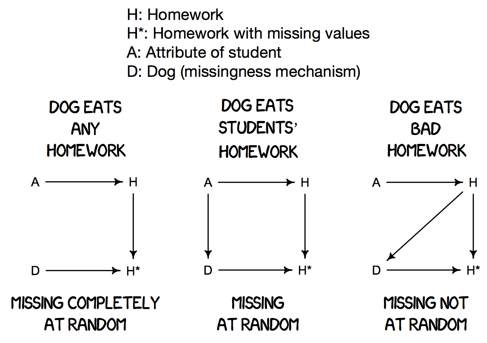
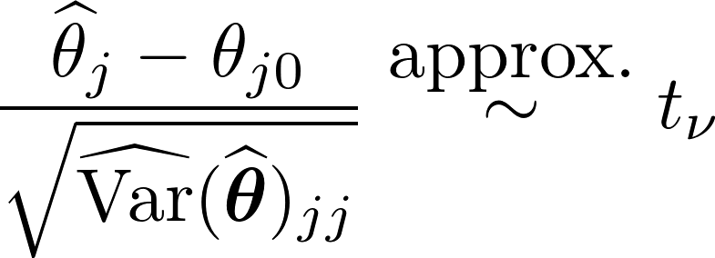
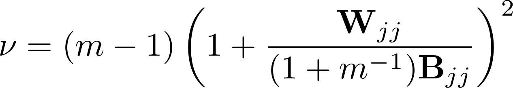

```{r setup, include=FALSE}
options(htmltools.dir.version = FALSE)
```

```{r, include=F}
# Load packages so that they don't cause warnings later
suppressPackageStartupMessages(library(tidyverse))
suppressPackageStartupMessages(library(knitr))
suppressPackageStartupMessages(library(kableExtra))
suppressPackageStartupMessages(library(stargazer))
#suppressPackageStartupMessages(library(simputation))
suppressPackageStartupMessages(library(rpart))
suppressPackageStartupMessages(library(glmnet))
suppressPackageStartupMessages(library(randomForest))
suppressPackageStartupMessages(library(norm))
suppressPackageStartupMessages(library(missForest))

# Setup knitr options
knitr::opts_chunk$set(collapse = TRUE,
    echo = TRUE,
    comment = NA,
    fig.align = "center",
    fig.height = 5,
    fig.width = 7, 
    warning=FALSE
)

skimr::skim_with(factor = list(top_counts = NULL, complete=NULL),
                 integer = list(complete=NULL))
```
```{r include=F, dev='svg', dev.args=list(bg = "transparent")}
invthm <- theme_minimal() + 
  theme(
    panel.background = element_rect(fill = "transparent", colour = NA), 
    plot.background = element_rect(fill = "transparent", colour = NA),
    legend.background = element_rect(fill = "transparent", colour = NA),
    legend.key = element_rect(fill = "transparent", colour = NA),
    text = element_text(colour = "white"),
    axis.text = element_text(colour = "white")
  )
```

class: split-50 with-border white hide-slide-number bg-black
background-image: url(`r params$titlebgimg`)
background-size: cover

.column.outline_text[.content[
<br><br><br>

# .brand-yellow[`r rmarkdown::metadata$title`]
## `r rmarkdown::metadata$subtitle`

.bottom_abs.width100.outline_text[
## Lecturer: .brand-yellow[`r rmarkdown::metadata$author`]

### `r rmarkdown::metadata$date`

]]]

.column.shade_black[.content[
# <u>Today you will learn</u>

* Visualizing missing data - naniar

* Simple imputation - simputation

* Multiple imputation - mice

]]


---

<center>

</center>


---

# Missing data

Missing data is a pervasive issue in the analysis of data and occurs in a
wide variety of contexts. Despite this pervasiveness, it is not often given
much attention in many undergraduate Statistics and Data Science degrees.

Part of the reason is due to the complexity of the topic, the additional
layer of terminology, and the common fear associated with 

"if you are not doing it right then you should steer clear of it" 

as a way of avoiding criticism. 

This doesn't help.

---

# Examples of missing data

Missing data occurs in models including, but not limited to:

* Regression;

* Survey data;

* Survival data;

* Longitudinal data; and

* Time series data.

How missing data can be handled depends relatively heavily on the
context the data was collected and which model is entertained. 

The methods for  handling missing data in one context may not make 
much sense in another context. 

---

# Our focus

Today we will focus on the situation where covariates are missing
in a regression context. 


Our main assumptions are:

* (Conditional) independent identically distributed samples.

* The missing data mechanism is ignorable (see next slide).

---

# Types of missing data


<center>

</center>

Theory: If the missing data mechanism is missing completely at random (MCAR)
or missing at random (MAR) then the missing data mechanism is ignorable
(so we don't need to model it).

---

# Case study: Pima-Indians diabetes

The Pima-Indians diabetes (PID) dataset is an immensely popular dataset
originally collected by the National Institute of Diabetes and Digestive and Kidney Diseases.
This dataset is part of the _mlbench_ package in _R_.

* pregnant- Number of times pregnant (count);

* glucose - Plasma glucose concentration (glucose tolerance test) (continuous);

* pressure - Diastolic blood pressure (mm Hg) (continuous);

* triceps	- Triceps skin fold thickness (mm) (continuous);

* insulin	- 2-Hour serum insulin (mu U/ml) (continuous);

* mass - Body mass index (weight in kg/(height in m)\^2) (continuous);

* pedigree - Diabetes pedigree function (continuous values);

* age	- Age (years) (count); and

* diabetes - a class variable (test for diabetes) with values "pos" and "neg" (binary).

---

layout: false
class: split-40 

.column.bg-brand-red.white[.content[

```{r, echo=TRUE, warning=FALSE}
library(mlbench)
data(PimaIndiansDiabetes)

g <- PimaIndiansDiabetes %>%
  keep(is.numeric) %>% 
  gather() %>% 
  ggplot(aes(value)) +
    facet_wrap(~ key, scales = "free") +
    geom_histogram() +
    theme_bw(base_size = 22)
```

]]


.column[.content[

```{r, echo=FALSE, warning=FALSE, fig.height=9, fig.width=9}
suppressMessages( print(g) )
```
]]

---

# Implicit missingness

In the previous slide the boxplots revealed implicit missing values in 
__glucose__, __pressure__, __triceps__, __insulin__, and __mass__ 
(since they can't be zero!). So we convert these explicitly to missing values.

```{r} 
tib <- as.tibble(PimaIndiansDiabetes)
is.zero <- function(x) { return(x==0); }

# Replace implicit missing values with NAs
dat <- tib %>%
  mutate_at(which(colnames(tib)%in%c("glucose","pressure","triceps","insulin","mass")),
            funs(replace(., is.zero(.), NA)))
```       
            
---

# Implicit missingness

Later some of the methods we will look at will assume that 
the missing covariates are normally distributed.

Most of the covariates are right skewed.

So we will convert these to log-scale so this assumption closer
to being satisfied.

```{r} 
varNames <- colnames(tib)
logTransVars <- c("pregnant","glucose","insulin","mass","pedigree","age")

dat <- dat %>%
  mutate_at(which(varNames%in%logTransVars),
            funs(log(1 + .))) %>%
  rename( 
    log1p_pregnant=pregnant,
    log1p_glucose=glucose,
    log1p_insulin=insulin,
    log1p_mass=mass,
    log1p_pedigree=pedigree,
    log1p_age=age
  )
```   


---

# Summarising statistics

```{r table missingness, results="asis"}
library(naniar)
library(knitr)
kable(miss_var_summary(dat),digits=2, format = "html")
```

---

# Visualizing relative amounts of missingness

```{r plot missingness, fig.height=6}
gg_miss_var(dat)
```

---

# Visualizing patterns and extent of missingess 

```{r pattern missingness, fig.height=6}
vis_miss(dat)
```

---

# Visualizing combinations of missingness

```{r upset missingness, fig.height=6}
gg_miss_upset(dat,text.scale = 2)
```

---

# The package nanair also has nice functions for tibbles - as_shadow

```{r}
dat_shadow <- as_shadow(dat)
dat_shadow
```

---
  
# The package nanair also has nice functions for tibbles - bind_shadow  

```{r}
shadow_dat <- dat  %>%
  bind_shadow()
shadow_dat
```

---

# Deletion methods

The most straightforward approach to dealing with missing data is to remove combinations of 
rows and/or columns to arrive at a complete dataset. The most common approach is to perform

* a complete case analysis (also called listwise deletion) where only samples containing 
complete information is used. 

* The second most common approach is called an available case
analysis (also called pairwise deletion) where a subset of variables are deleted first 
before removing all samples that contain missing values.

Both these approaches assume MCAR or MAR.

---

# Complete and available case fits

```{r, echo=TRUE}
dat_complete <- dat %>%
  drop_na()  

res.glm1 <- glm(diabetes~.,data=dat_complete,family=binomial)
res.glm2 <- glm(diabetes~.-triceps-log1p_insulin,
                data=dat_complete,family=binomial)

dat_available1 <- dat %>%
  select(-triceps,-log1p_insulin) %>%
  drop_na()  

dat_available2 <- dat %>%
  select(-triceps,-log1p_insulin,-pressure) %>%
  drop_na()

res.glm3 <- glm(diabetes~.,data=dat_available1,family=binomial)
res.glm4 <- glm(diabetes~.,data=dat_available2,family=binomial)
```

---

# Comparing complete and available case analyses

```{r, echo=TRUE, results="asis"}
library(stargazer)
stargazer(res.glm1, res.glm2, res.glm3, res.glm4,  
          title="Results", align=TRUE, type="html", style = "ajs",
          notes="PID fit using complete case and available case analysis")
```


---

# Single imputation methods

* The next step is to fill in the missing values with "realistic"
values. 

* This should be done with some care...

* Suppose we fill in all missing values for a particular covariate 
with the mean of the values in that covariate then the variance
of that covariate becomes artificially smaller.

* This means inferences based on these methods will be, in general, unreliable.

* However, if the goal is prediction then single imputation methods
can still be reasonable.

---
 

# Simple imputation methods

We will consider a number of methods now that replace all missing values
with a single value. 

* Mean/Median substitution.
* Regression imputation.
  - Linear regression models.
  - Robust regression models.
  - Penalized regression.
* Machine learning imputation
  - K-nearest neighbours.
  - Cart imputation
  - Random forest imputation.

There is also hotdeck imputation (which I will not cover here)
and expectation maximization.

---

# Simple imputation methods
 
```{r, echo=FALSE, result="asis"}
tab <- matrix(c(
"impute_rlm","M-estimation","MASS",
"impute_en","ridge/elasticnet/lasso","glmnet",   
"impute_cart","CART	","rpart",
"impute_rf","random forest","randomForest",
"impute_rhd","random hot deck","VIM (optional)",
"impute_shd","sequential hot deck","VIM (optional)",
"impute_knn","k nearest neighbours","VIM (optional)",
"impute_mf","missForest","missForest",
"impute_em","mv-normal","norm"),9,3,byrow=TRUE)
colnames(tab) <- c("function","method","library")
kable(tab,format="markdown", padding = 2) %>%
  kable_styling(bootstrap_options = c("striped", "hover", "condensed"))
```

The general syntax is and the formula is of the form
```{r, eval=FALSE}
impute_<model>(data, formula, [model-specific options])

IMPUTED ~ MODEL_SPECIFICATION [ | GROUPING ]
```

---

# Mean/Median substitution

```{r, warning=FALSE}
suppressPackageStartupMessages(library(simputation))

# Impute all missing values by their median value
dat_imp1 <- dat %>%
  impute_lm(log1p_glucose ~ 1) %>%
  impute_lm(pressure ~ 1) %>% 
  impute_lm(triceps ~ 1) %>%
  impute_lm(log1p_insulin ~ 1) %>%
  impute_lm(log1p_mass ~ 1)

# Impute all missing values by their median value
dat_imp2 <- dat %>%
  impute_median(log1p_glucose ~ 1) %>%
  impute_median(pressure ~ 1) %>% 
  impute_median(triceps ~ 1) %>%
  impute_median(log1p_insulin ~ 1) %>%
  impute_median(log1p_mass ~ 1)

res.glm5 <- glm(diabetes~.,data=dat_imp1,family=binomial)
res.glm6 <- glm(diabetes~.,data=dat_imp2,family=binomial)
```

---

# Mean substitution with added noise

```{r}
# Impute all missing values by their mean value add normal noise
dat_imp3 <- dat %>%
  impute_lm(log1p_glucose ~ 1, add_residual="normal") %>%
  impute_lm(pressure ~ 1, add_residual="normal") %>% 
  impute_lm(triceps ~ 1, add_residual="normal") %>%
  impute_lm(log1p_insulin ~ 1, add_residual="normal") %>%
  impute_lm(log1p_mass ~ 1, add_residual="normal")

# Impute all missing values by their mean value add residuals to result
dat_imp4 <- dat %>%
  impute_median(log1p_glucose ~ 1, add_residual="observed") %>%
  impute_median(pressure ~ 1, add_residual="observed") %>% 
  impute_median(triceps ~ 1, add_residual="observed") %>%
  impute_median(log1p_insulin ~ 1, add_residual="observed") %>%
  impute_median(log1p_mass ~ 1, add_residual="observed")

res.glm7 <- glm(diabetes~.,data=dat_imp3,family=binomial)
res.glm8 <- glm(diabetes~.,data=dat_imp4,family=binomial)
```

---

```{r, echo=TRUE, results="asis"}
stargazer(res.glm3, res.glm5, res.glm6, res.glm7, res.glm7,
          title="Results", align=TRUE, type="html", style = "ajs",
          notes="PID fit using complete case and single imputation analysis")
```


# Regression imputation

```{r}
summary(lm(log1p_insulin~.,data=dat_complete))
```


---

# Regression imputation

```{r}
imp1 <- shadow_dat %>%
  impute_lm(log1p_insulin~log1p_glucose+log1p_mass)
imp2 <- shadow_dat %>%
  impute_lm(log1p_insulin~log1p_glucose+log1p_mass, add_residual="normal")

# Get the ggarrange function
suppressPackageStartupMessages(library(ggpubr))
```


---

# Regression imputation

```{r,fig.width=12,fig.height=7}
g1 <- imp1 %>%
  ggplot(aes(x = log1p_glucose, y = log1p_insulin, colour = log1p_insulin_NA )) + 
  geom_point()
g2 <- imp2 %>%
  ggplot(aes(x = log1p_glucose, y = log1p_insulin, colour = log1p_insulin_NA )) + 
  geom_point()

ggarrange(g1, g2, labels = c("lm impute", "lm impute + noise"), ncol = 2, nrow = 1)
```  

 

 
---
 
# Nearest neighbour imputation

```{r}
library(DMwR)
dat_imp1 <- as.tibble(knnImputation(data.matrix(dat),k=1))
dat_imp2 <- as.tibble(knnImputation(data.matrix(dat),k=2))
dat_imp3 <- as.tibble(knnImputation(data.matrix(dat),k=3))
```

---

# Visualizing the imputed values

```{r, echo=FALSE,fig.width=12,fig.height=7}
any.na <- function(x) { return(any(is.na(x))) }
ind_na <- apply(dat,1,any.na)

g1 <- dat_imp1  %>%
  ggplot(aes(x = log1p_glucose,
             y = log1p_insulin,
             colour = ind_na )) + 
  geom_point()
 
 
g2 <- dat_imp2  %>%
  ggplot(aes(x = log1p_glucose,
             y = log1p_insulin,
             colour = ind_na )) + 
  geom_point()
 
g3 <- dat_imp3  %>%
  ggplot(aes(x = log1p_glucose,
             y = log1p_insulin,
             colour = ind_na )) + 
  geom_point()

g4 <- dat_imp1 %>%
  ggplot(aes(x = log1p_mass,
             y = triceps,
             colour = ind_na )) + 
  geom_point()
 
g5 <- dat_imp2 %>%
  ggplot(aes(x = log1p_mass,
             y = triceps,
             colour = ind_na )) + 
  geom_point()
 
g6 <- dat_imp3 %>%
  ggplot(aes(x = log1p_mass,
             y = triceps,
             colour = ind_na )) + 
  geom_point()
 
ggarrange(g1, g2, g3, g4, g5, g6, 
          labels = c("k=1", "k=2", "k=3","k=1", "k=2", "k=3"),
          ncol = 3, nrow = 2)
```

 
---

# Multivariate normal expectation maximization

```{r}
library(norm)

dat_imp <- dat %>%
  impute_em(log1p_glucose ~ log1p_insulin + log1p_age) %>%
  impute_em(pressure ~ log1p_mass + log1p_age)  %>% 
  impute_em(log1p_insulin ~ log1p_glucose + log1p_mass) %>%
  impute_em(log1p_mass ~ log1p_pregnant + pressure + triceps + log1p_insulin) %>%
  impute_em(triceps ~ log1p_mass) 

g1 <- dat_imp %>%
  ggplot(aes(x = log1p_glucose, y = log1p_insulin, colour = ind_na )) + 
  geom_point()
g2 <- dat_imp %>%
  ggplot(aes(x = triceps, y = log1p_mass, colour = ind_na )) + 
  geom_point()
```

---

# Multivariate normal expectation maximization

```{r,fig.width=12,fig.height=7}
ggarrange(g1, g2, ncol = 2, nrow = 1)
```  
---


# Multiple imputation

When inference is important then data should be imputed multiple times.

The process to do this is really, really complicated since there are two
sources of variation

1. Variation from estimation of model parameters (including any in the
model for the covariates);

2. Variation from the missing values.

Many methods iterate between addressing these to form a Markov chain where the
imputed values mimic draws from the right (posterior) distribution.

Usually a small number of completed datasets are needed, say $m=5$ is
often recommended, with 20 iterations between estimating model parameters
and imputing missing values. Symbolically we impute a matrix 
${\bf X}^{(mis)}$ that contains missing values and mice outputs $m$
complete datasets (containing no missing values)
$$
{\bf X}^{(1)},\ldots,{\bf X}^{(m)}.
$$
---

# Combining the Results

Suppose that the estimates of ${\boldsymbol\theta}$ corresponding to ${\bf X}^{(1)},\ldots,{\bf X}^{(m)}$ are
$$
\widehat{\boldsymbol\theta}^{(1)}, \ldots, \widehat{\boldsymbol\theta}^{(m)}
$$

 where the sampling variances for each of the estimates are
$$
\widehat{\bf V}^{(1)}, \ldots, \widehat{\bf V}^{(m)}.
$$

Then the commonly used point estimate for ${\boldsymbol\theta}$ is
$$
\widehat{\boldsymbol\theta} = \frac{1}{m} \sum_{i=1}^m \widehat{\boldsymbol\theta}^{(i)}
$$

---

# Combining the Results

The estimated variance of $\widehat{\boldsymbol\theta}$ is
$$
\widehat{\mbox{Var}}(\widehat{\boldsymbol\theta}) = \left( 1 + \frac{1}{m} \right) {\bf B} + {\bf W}
$$

where the between and within variances are:
$$
{\bf B} = 
\frac{1}{m - 1} \sum_{i=1}^m  
(\widehat{\boldsymbol\theta}^{(i)} - \widehat{\boldsymbol\theta})
(\widehat{\boldsymbol\theta}^{(i)} - \widehat{\boldsymbol\theta})^T
$$

and 
$$
{\bf W} = \frac{1}{m} \sum_{i=1}^m \widehat{\bf V}^{(i)}.
$$

---

# Testing Scalars

Suppose that we want to test that $\theta_j = \theta_{j0}$ for a 
particular $j$. Rubin (1987) showed that
<center>

</center>


where
<center>

</center>

The statistic $r_j = (1 + m^{-1}){\bf B}_{jj}/{\bf W}_{jj}$ can be interpreted 
as the relative increase in variance due to missing data.  


 
---

# Multiple imputation - mice

```{r}
suppressPackageStartupMessages(library(mice))

# airquality has two variables with missing values Ozone and Solar.R
# Generate 5 complete datasets using the patterm mixture model
imputed_Data <- mice(airquality, m=5, maxit = 50, method = 'pmm', seed = 1,printFlag = FALSE)

summary(imputed_Data)
```

---

# Multiple imputation - mice

```{r}
# Get the m=5 different missing values
head( imputed_Data$imp$Ozone )
```

---

# Multiple imputation - mice

We can then fit multiple models using each complete dataset

```{r}
fit <- with(data = imputed_Data, exp = lm(Ozone ~ Solar.R + Wind + Temp )) 

#combine results of all 5 models using Rubin's rule
combine <- pool(fit)
kable( summary(combine), digits = 3 )
```
 

---

# Other multiple imputation packages
 
The main alternatives to mice are:

* Amelia

* missForest

* Hmisc

* mi

---

# Thank you !

<center>

</center>

